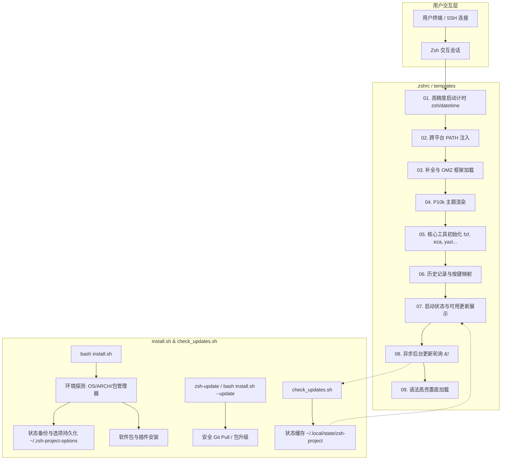
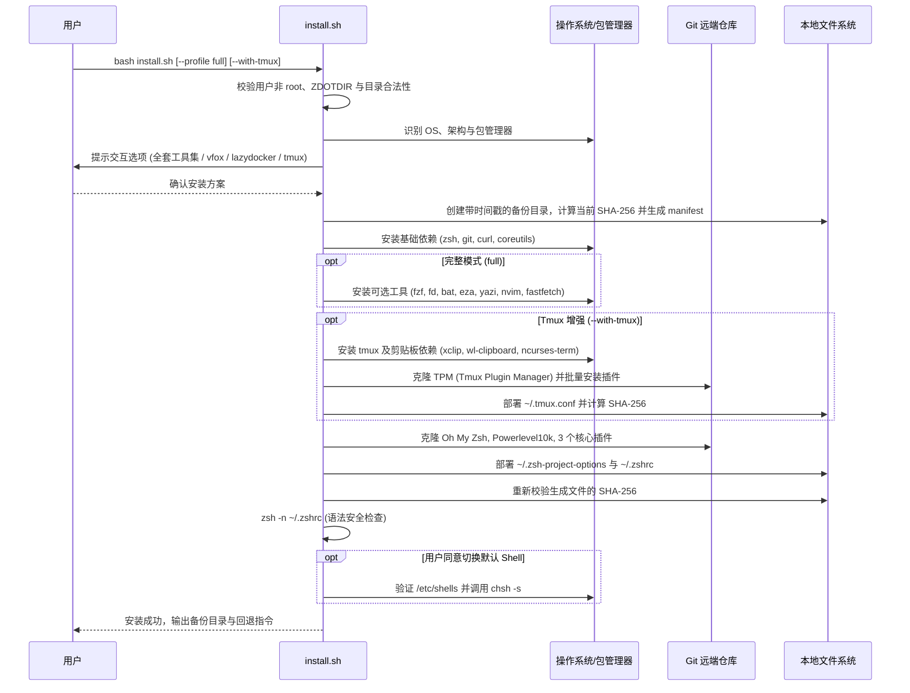

# Zsh 跨平台一键配置项目开发与架构设计文档

更新日期：2026-09-06  
适用范围：Linux（Debian / Ubuntu / Fedora / Arch / openSUSE）与 macOS（Darwin / Apple Silicon & Intel Mac）

---

## 目录

- [一、项目设计目标与技术选型](#一项目设计目标与技术选型)
- [二、系统整体架构与分层设计](#二系统整体架构与分层设计)
- [三、Zsh 加载生命周期与配置规范](#三zsh-加载生命周期与配置规范)
- [四、跨平台兼容性工程规范 (Linux 与 macOS)](#四跨平台兼容性工程规范-linux-与-macos)
- [五、安装器 `install.sh` 架构与实现细节](#五安装器-installsh-架构与实现细节)
- [六、版本自动检测与更新系统设计](#六版本自动检测与更新系统设计)
- [七、数据持久化、备份与回滚机制](#七数据持久化备份与回滚机制)
- [八、本地测试、Mock 与调试规范](#八本地测试mock-与调试规范)
- [九、代码风格、安全与维护约定](#九代码风格安全与维护约定)

---

## 一、项目设计目标与技术选型

### 1.1 核心设计目标

1. **开箱即用，全自动化**：为不同架构（`x86_64`、`aarch64`、`arm64`）和不同操作系统（Debian/Ubuntu/Fedora/Arch 及 macOS）提供无缝的安装与交互体验。
2. **极速与零阻塞**：
   - 保证 Zsh 终端在 50~1000ms 内快速完成启动；
   - 坚决杜绝在交互式终端前台启动过程中发起同步网络请求；
   - 即使在弱网或完全离线环境下，终端打开亦不受任何影响。
3. **安全与确定性**：
   - 任何改动均保留完整备份（快照清单 + SHA-256 校验）；
   - 更新组件前检测本地 Git 工作区状态，严禁无感知覆盖用户自定义修改；
   - 完备的语法预检（`zsh -n`）机制，防止因语法中断导致终端无法打开。
4. **防御性编程**：各模块与工具之间彻底解耦，任何单一工具（如 vfox、fastfetch、lazydocker）缺失或报错，绝不影响 Shell 整体加载。

### 1.2 技术选型考量

- **宿主语言**：纯 `Bash 4.0+`（安装器与后台检测脚本）+ `Zsh 5.0+`（终端配置与模板）。
  - *原因*：无需预装 Python、Node.js 或 Go 等重型运行环境，任何 Linux 服务器或 macOS 开箱即可运行。
- **框架体系**：**Oh My Zsh** 作为核心底座，**Powerlevel10k** 作为高性能提示符主题。
- **工具生态**：统一推荐现代化 Rust 编写的轻量命令行工具链（`fzf`、`fd`、`bat`、`eza`、`zoxide`、`yazi`），提升终端工作流效率。

---

## 二、系统整体架构与分层设计

本项目采用“安装器解耦 + 模板渲染 + 状态持久化 + 后台异步守护”的模块化架构：



---

## 三、Zsh 加载生命周期与配置规范

为了避免常见插件冲突与启动性能劣化，`.zshrc` 与 `templates/zshrc.zsh` 严格遵循以下加载顺序规范：

```
[阶段 01] 计时器初始化 (zmodload zsh/datetime)
   ↓
[阶段 02] Instant Prompt 策略控制 (明确声明关闭)
   ↓
[阶段 03] 全局环境变量与 PATH 唯一化 (typeset -U path PATH)
   ↓
[阶段 04] Oh My Zsh 变量设置 (ZSH_THEME="", ZSH_CUSTOM)
   ↓
[阶段 05] 核心插件列表定义 (git, sudo, extract 等)
   ↓
[阶段 06] 额外补全目录提前注册 (fpath 注入 zsh-completions/src)
   ↓
[阶段 07] 加载 OMZ 主程序或备用 compinit
   ↓
[阶段 08] Powerlevel10k 主题及个人外观文件 (~/.p10k.zsh)
   ↓
[阶段 09] 启动状态横幅展示
   ↓
[阶段 10] vfox 激活 (带 timeout 超时保护并卸载自动钩子)
   ↓
[阶段 11] Yazi 目录联动函数封装 (y 命令)
   ↓
[阶段 12] FZF 快捷键与预览命令绑定 (集成 fd, bat, eza)
   ↓
[阶段 13] 历史记录行为设置 (share_history, 前缀搜索绑定)
   ↓
[阶段 14] 现代化命令别名与工具加载 (eza 别名, lazydocker, zoxide)
   ↓
[阶段 15] 系统信息展示 (fastfetch)
   ↓
[阶段 16] 新版本检测本地缓存读取与后台轮询触发
   ↓
[阶段 17] 语法高亮插件置底加载 (必须在所有按键与别名之后)
   ↓
[阶段 18] precmd 触发并打印毫秒启动耗时
```

> [!IMPORTANT]
> ### 关键加载规则约束
> 1. **补全初始化单次原则**：`zsh-completions` 的 `src` 目录必须在加载 `oh-my-zsh.sh` **之前**加入 `fpath`；绝对不能在 OMZ 之前手动调用 `compinit`，否则会导致重复扫描补全导致启动变慢。
> 2. **语法高亮置底原则**：`zsh-syntax-highlighting` 必须在配置文件的**绝对末尾**加载。若在其后定义按键绑定或别名，可能导致高亮状态失效或按键绑定被覆盖。
> 3. **Instant Prompt 约束**：由于本项目包含横幅、工具状态输出及 Fastfetch 硬件信息展示，任何在前台打印文本的操作都会与 Instant Prompt 发生冲突导致警告，因此显式设置 `typeset -g POWERLEVEL9K_INSTANT_PROMPT=off`。

---

## 四、跨平台兼容性工程规范 (Linux 与 macOS)

本项目在多平台工程实现中严格遵循以下差异化规范：

### 4.1 操作系统支持范围与版本边界矩阵

项目经过全平台测试与工具链审计，确立以下最低与最高支持版本边界：

| 操作系统体系 | 硬件架构 | 最低支持版本 | 推荐版本 | 最高支持版本 | 技术决定依据与边界分析 |
| --- | --- | --- | --- | --- | --- |
| **macOS (Apple Silicon)** | `arm64` (M1-M4) | **macOS 11.0 (Big Sur)** | macOS 14 / 15+ | **macOS 15.x+ (最新)** | 苹果芯片硬件起步系统；Homebrew 核心原生架构；预装 Zsh 5.8 |
| **macOS (Intel)** | `x86_64` | **macOS 10.15 (Catalina)** | macOS 13 / 14 | **macOS 15.x+ (最新)** | Apple 首次将 Zsh 设为系统默认 Shell；低于此版本（Mojave 10.14）预装古董 Bash 3.2 且无默认 Zsh |
| **Debian** | `x86_64`, `aarch64` | **Debian 10 (Buster)** | Debian 12 / 13 | **Debian 13 (Trixie) / Sid** | 仓库附带 Zsh 5.7+ 与 Git 2.20；实测验证环境为 Debian 13 / Zsh 5.9 |
| **Ubuntu** | `x86_64`, `aarch64` | **Ubuntu 20.04 LTS** | Ubuntu 22.04 / 24.04 | **Ubuntu 24.10 / 25.04+** | 20.04 附带稳定 Zsh 5.8 与 Glibc 2.31；18.04 因官方已结束标准支持且 Zsh 版本偏低不推荐 |
| **Fedora** | `x86_64`, `aarch64` | **Fedora 34** | Fedora 39 / 40 / 41 | **Fedora 41 / Rawhide** | 附带现代 DNF 与 Zsh 5.8+；持续滚动支持最新 upstream |
| **RHEL / Rocky / Alma** | `x86_64`, `aarch64` | **RHEL 8.0+** | RHEL / Rocky 9.x | **RHEL 9.x / 10.x** | RHEL 8 包含 Zsh 5.5.8 与 Bash 4.4；RHEL 7 仅有 Zsh 5.0.2（低于 P10k 5.1 门槛）且已 EOL |
| **Arch Linux / Manjaro** | `x86_64`, `aarch64` | **Rolling (近半年更新)** | 最新滚动画卷 | **Rolling (持续向前)** | 滚动发行版模型，Pacman 自动保持核心组件为最新稳定版 |
| **openSUSE** | `x86_64`, `aarch64` | **Leap 15.4+** | Leap 15.6 / Tumbleweed | **Tumbleweed (Rolling)** | Zypper 原生适配；Leap 15.4 具备现代 Zsh 5.8+ |

#### 关键依赖底线基准 (Hard Prerequisites)
- **Zsh >= 5.1**：Oh My Zsh 与 Powerlevel10k 运行硬性要求（低于 5.1 主题提示符与截断逻辑异常）。
- **Bash >= 4.2**：`install.sh` 与 `check_updates.sh` 依赖严格错误陷阱 `set -Eeuo pipefail` 与关联数组支持。
- **Git >= 2.0**：需支持深度浅克隆 `git clone --depth=1` 以及路径隔离参数 `git -C <dir>`。
- **Glibc >= 2.28 (Linux) / Darwin >= 19.0 (macOS)**：现代预编译 CLI 工具（eza、yazi 等 Rust 二进制）运行依赖。

### 4.2 跨平台包管理器与命令映射表

| 维度 | Linux (Debian/Ubuntu) | Linux (Fedora/RHEL) | Linux (Arch) | macOS (Darwin) |
| --- | --- | --- | --- | --- |
| **系统标识 (`uname -s`)** | `Linux` | `Linux` | `Linux` | `Darwin` |
| **包管理器** | `apt-get` | `dnf` | `pacman` | `brew` (Homebrew) |
| **权限模型** | 普通用户 + `sudo` | 普通用户 + `sudo` | 普通用户 + `sudo` | 普通用户运行（**严禁** `sudo brew`） |
| **包管理器架构** | `x86_64`, `aarch64` | `x86_64`, `aarch64` | `x86_64`, `aarch64` | `x86_64` (Intel), `arm64` (Apple Silicon) |
| **Homebrew 根路径** | `/home/linuxbrew/.linuxbrew` (可选) | - | - | `/opt/homebrew` (Apple Silicon)<br>`/usr/local` (Intel) |
| **命令名差异 (fd)** | `fdfind` (包名 `fd-find`) | `fd-find` | `fd` | `fd` |
| **命令名差异 (bat)** | `batcat` (包名 `bat`) | `bat` | `bat` | `bat` |
| **超时命令** | `timeout` | `timeout` | `timeout` | `gtimeout` (需 coreutils) / 降级 |
| **哈希工具** | `sha256sum` | `sha256sum` | `sha256sum` | `shasum -a 256` / `openssl` |

### 4.3 核心兼容性代码模式

#### 1. 跨平台高精度计时 (避免 macOS BSD `date` 报错)
```zsh
# 跨平台高精度毫秒计时
if zmodload zsh/datetime 2>/dev/null; then
  ZSH_START_TIME=$EPOCHREALTIME
  precmd() {
    local end_time=$EPOCHREALTIME
    local elapsed=$(( int((end_time - ZSH_START_TIME) * 1000) ))
    print -P "%F{green}⚡ Zsh 启动完成，用时 %F{yellow}${elapsed}ms%f"
    unset -f precmd
  }
fi
```

#### 2. 安全的超时防护封装
```bash
# 兼具 Linux timeout 与 macOS gtimeout 的执行器
run_with_timeout() {
  local sec=$1; shift
  if command -v timeout >/dev/null 2>&1; then
    timeout "$sec" "$@"
  elif command -v gtimeout >/dev/null 2>&1; then
    gtimeout "$sec" "$@"
  else
    "$@"
  fi
}
```

#### 3. 跨平台 SHA-256 计算
```bash
calc_sha256() {
  local target=$1
  if command -v sha256sum >/dev/null 2>&1; then
    sha256sum "$target" 2>/dev/null | cut -d ' ' -f1
  elif command -v shasum >/dev/null 2>&1; then
    shasum -a 256 "$target" 2>/dev/null | cut -d ' ' -f1
  elif command -v openssl >/dev/null 2>&1; then
    openssl dgst -sha256 "$target" 2>/dev/null | awk '{print $NF}'
  else
    die "系统中未找到 sha256sum、shasum 或 openssl 计算工具"
  fi
}
```

---

## 五、安装器 `install.sh` 架构与实现细节

### 5.1 执行时序图



### 5.2 状态持久化配置 (`~/.zsh-project-options`)

安装器会生成轻量级的选项状态文件，供 `.zshrc` 加载时读取。格式严格遵循键值对声明：

```bash
# 安装器生成；1 为启用，0 为关闭。
ZSH_PROJECT_FULL=1
ZSH_PROJECT_VFOX=0
ZSH_PROJECT_LAZYDOCKER=0
ZSH_PROJECT_TMUX=1
ZSH_PROJECT_DIR="/home/user/.zsh-project"
ZSH_PROJECT_AUTO_CHECK_UPDATE=1
ZSH_PROJECT_CHECK_INTERVAL_DAYS=7
```

---

## 附录：Tmux 架构与全平台剪贴板穿透工程规范

### 1. 终端剪贴板穿透核心痛点与解决方案

在复杂的远程开发、虚拟机及容器场景下，传统的 `xclip` / `pbcopy` 常常因缺乏本地显示服务（`$DISPLAY` 或 `$WAYLAND_DISPLAY`）而失效。本项目采用 **OSC 52 + 智能本地多工具降级** 的双保险机制：

```mermaid
flowchart TD
    A[用户划选 / Vi 键位复制] --> B{Tmux copy-mode}
    B --> C[触发 OSC 52 转义码透传]
    C --> D[外层终端: Windows Terminal / iTerm2 / WezTerm / Alacritty]
    D --> E[物理机操作系统剪贴板]
    
    B --> F[并发触发智能管道降级]
    F --> G{环境探测}
    G -- Wayland --> H[wl-copy]
    G -- X11 --> I[xclip -selection clipboard]
    G -- macOS --> J[pbcopy]
    G -- WSL --> K[clip.exe]
    G -- 无剪贴板工具 --> L[|| true 静默容错，不抛错误蜂鸣]
```

### 2. 鼠标体验防跳跃设计
- **经典痛点**：tmux 默认在鼠标松开（`MouseDragEnd1Pane`）后调用 `copy-pipe-and-cancel`，导致屏幕立即跳回底部并退出复制模式，极易破坏正在排查的长日志视图。
- **工程解决**：绑定 `MouseDragEnd1Pane` 执行 `copy-pipe`（去除 `-and-cancel`）。用户划选后自动静默同步至剪贴板，同时视野锚定在当前窗格位置，极大提升调试体验。

---

## 六、版本自动检测与更新系统设计

### 6.1 模块职责划分

1. **`scripts/check_updates.sh`**（检测内核）：
   - 执行快速网络联通性检测（2 秒连接测试，避免无网阻塞）；
   - 对 Git 仓库执行带超时的静默 `git fetch`；
   - 比较 `HEAD` 与跟踪上游分支的哈希差异，计算落后提交数（`behind count`）；
   - 调用系统包管理器命令（macOS `brew outdated`、Debian `apt list --upgradable`、Arch `checkupdates`）获取工具更新；
   - 将更新汇总清单以纯文本格式原子写入 `${XDG_STATE_HOME:-$HOME/.local/state}/zsh-project/available_updates`。
2. **`templates/zshrc.zsh`**（前端展示与后台调度）：
   - 终端打开时读取本地缓存，有更新则以亮色横幅提醒；
   - 根据上次检查时间戳与配置的间隔天数（默认 7 天），触发 `( check_updates.sh -q ) &!` 异步后台轮询。
3. **`install.sh --update`**（升级执行引擎）：
   - 展示更新清单并由用户显式确认（`[y/N]`）；
   - 安全拉取 Git 更新（若检测到 `git status --porcelain` 存在未提交修改，则跳过并报警，防止覆盖）；
   - 触发包管理器升级对应工具；
   - 清理更新状态缓存，并重新校验 `zsh -n ~/.zshrc`。

### 6.2 缓存与状态文件结构

```
~/.local/state/zsh-project/
├── available_updates          # 当前检测到的可更新组件清单 (空则表示无更新)
├── last_update_check          # 上次执行检测的时间戳 (Unix Epoch 秒)
└── scripts/
    └── check_updates.sh       # 检测脚本的持久化副本
```

---

## 七、数据持久化、备份与回滚机制

### 7.1 备份目录结构

每次执行 `install.sh` 安装或更新，均会在状态目录下生成隔离的备份目录：

```
~/.local/state/zsh-project/install-XXXXXXXX/
├── manifest                   # 记录当前用户的 HOME 目录路径
├── .zshrc                     # 原 .zshrc 副本
├── .zshrc.state               # 原状态：present 或 absent
├── .zshrc.sha256              # 原文件的 SHA-256 校验和
├── .zsh-project-options       # 原选项文件副本
├── .zsh-project-options.state # 原状态
├── .zsh-project-options.sha256
└── install.log                # 完整的安装执行日志
```

### 7.2 回滚校验流程 (`restore()`)

1. **归属校验**：检查 `manifest` 中的家目录是否与当前 `$HOME` 一致。
2. **状态防篡改校验**：
   - 重新计算当前 `~/.zshrc` 的 SHA-256 哈希值；
   - 若当前文件已被用户安装后手动修改，则中断恢复并报错：`文件在安装后发生变化，请手动比较备份再恢复`，防止意外覆盖用户最新代码。
3. **原子还原**：根据 `.state` 记录，将原文件覆盖恢复或删除新生文件。

---

## 八、本地测试、Mock 与调试规范

### 8.1 静态语法校验

修改脚本或模板后，必须通过严格的静态解析测试：

```bash
# 校验 Bash 脚本语法
bash -n install.sh
bash -n scripts/check_updates.sh

# 校验 Zsh 配置与模板语法
zsh -n templates/zshrc.zsh
zsh -n .zshrc
```

### 8.2 跨平台行为 Mock 测试方法

在非目标平台（如 Windows MSYS2 或单一 Linux 发行版）开发时，可通过子 Shell 函数重载进行行为模拟：

#### 模拟 macOS (Darwin + arm64) Dry-run
```bash
bash -c '
  uname() {
    if [[ "$1" == "-s" ]]; then echo "Darwin"
    elif [[ "$1" == "-m" ]]; then echo "arm64"
    else /usr/bin/uname "$@"
    fi
  }
  export -f uname
  bash install.sh --dry-run --profile full
'
```

#### 模拟 Debian Linux Dry-run
```bash
bash -c '
  uname() {
    if [[ "$1" == "-s" ]]; then echo "Linux"
    elif [[ "$1" == "-m" ]]; then echo "x86_64"
    else /usr/bin/uname "$@"
    fi
  }
  export -f uname
  bash install.sh --dry-run --profile full
'
```

### 8.3 启动性能与卡顿定位方法

若用户报告终端启动卡顿或提示符卡死，按以下步骤定位：

```bash
# 跟踪完整交互启动流程，定位具体卡顿语句
PS4='+%N:%i> ' timeout -k 2s 20s zsh -xic 'exit'

# 单独验证 vfox 激活性能
timeout -k 1s 5s vfox activate zsh
```

---

## 九、代码风格、安全与维护约定

1. **环境声明与严格模式**：
   - Bash 脚本开头必须声明：`set -Eeuo pipefail` 与 `export LC_ALL=C`；
   - 临时文件必须通过 `mktemp` 创建，权限统一设置 `chmod 700`。
2. **字符集与换行符**：
   - 所有文本文件、Shell 脚本必须使用 **UTF-8 无 BOM** 编码；
   - 换行符严格采用 **LF (`\n`)**，禁止使用 Windows CRLF 换行符提交。
3. **变量作用域**：
   - 函数内变量统一显式声明 `local`；
   - Zsh 中的数组必须小心处理带空格参数（推荐使用 `"${(@)...}"` 语法）。
4. **Git 操作安全防线**：
   - 严禁在脚本中执行 `git reset --hard` 或 `git clean -fd`；
   - 更新仅支持 `--ff-only` 快进拉取，遇到合并冲突时提示用户手动处理。
5. **权限严控**：
   - 必须先判断当前用户是否为普通用户（`[[ $EUID -ne 0 ]]`）；
   - 严禁整个安装过程以 root/sudo 全局运行。

---

## 十、借鉴 romkatv/zsh4humans 的工业级 Shell 工程规范

本项目吸收了 [romkatv/zsh4humans](https://github.com/romkatv/zsh4humans)（Powerlevel10k 作者）的核心工程实践：

### 10.1 防 Sudo 踩坑防护（Anti-Sudo Check）
- **痛点**：新手常使用 `sudo bash install.sh`，导致用户家目录生成的 `.zshrc`、`~/.local/`、插件目录属主被赋为 root，后续普通用户无法写入历史或更新。
- **规范**：检测若当前为 root 但 `$HOME` 拥有者为非 root，立即中断并提示用户以普通身份重新运行。

### 10.2 终端 TTY 保护与状态还原 Trap
- **痛点**：若用户中途按 `Ctrl+C` 中断或发生错误，可能导致终端停留在非规范模式（无回显或键位错乱）。
- **规范**：脚本启动时用 `command stty -g` 记录终端原始状态，并在 `trap cleanup_terminal INT TERM EXIT` 中确保无论如何都安全恢复。

### 10.3 单键免回车瞬时读取（`read_key`）
- **规范**：利用 `stty -icanon min 1 time 0` 与 `dd bs=1 count=1`，捕获用户单次敲击（`y`/`n`/`1`/`2`/`q`），按下瞬间立刻触发下一步，免去繁琐的 Enter 回车确认。

### 10.4 管道免克隆远程自举（Pipe Execution Bootstrap）
- **规范**：支持 `bash -c "$(curl -fsSL ...)"` 一行命令安装。检测若处于管道运行模式，自动将源码自举拉取至 `~/.config/zsh-project-repo`，并在原地衔接完整安装。

### 10.5 底层操作防别名劫持（`command` 显式包裹）
- **规范**：对底层文件与系统工具（`rm`, `cp`, `mv`, `mkdir`, `id`, `uname` 等）均包裹 `command` 前缀，彻底免疫系统全局或用户环境中的干扰性别名（如 `alias rm='rm -i'`）。

### 10.6 过期编译字节码（`.zwc`）清理与原子替换
- **规范**：新配置文件就绪后，主动清理历史残余的 `.zshrc.zwc` 与 `.zshenv.zwc`，确保 Zsh 启动时立刻读取最新语法树。

### 10.7 安装完成自举体验（Instant Bootstrapping）
- **规范**：配置安装成功且切换 Shell 确认后，提供一键 `exec zsh -l` 直接接管当前进程，无缝切入新环境。
