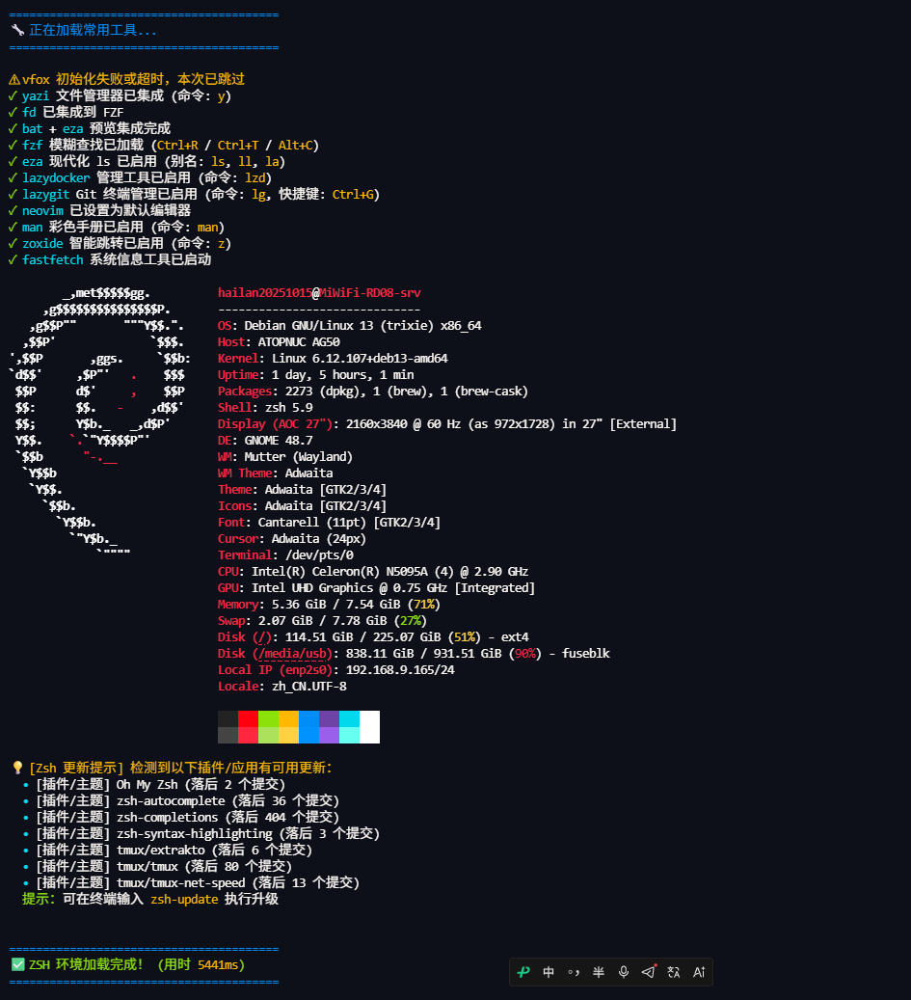

# Linux 与 macOS Zsh 配置与更新管理器

为个人终端配置 Oh My Zsh、Powerlevel10k、补全、自动建议和语法高亮，并提供可选工具安装、配置开关、更新检测、停用恢复与备份管理。

本文以当前 `install.sh`、`scripts/` 和 `templates/` 的实现为准。平台适配目标与实际验证结果分开记录；最近一次本地检查见[测试与验收](INSTALLER_TESTING.md)。

## 项目展示

下图为 Debian GNU/Linux 13、Zsh 5.9 环境中的终端启动截图。



- **顶部工具状态**：显示 Yazi、FZF、eza、lazygit、Neovim、zoxide 等集成信息，以及常用命令和快捷键。
- **中部系统信息**：Fastfetch 展示 Debian 标识、系统、内核、桌面环境和硬件资源。
- **底部更新提醒**：展示缓存中的插件更新清单，可运行 `zsh-update` 进入更新流程。
- **加载计时**：`5441ms` 是这一次配置内计时的结果，不包括完整的终端连接过程，也不包含随后加载的用户扩展、高亮和首次提示符钩子。

图中的 `vfox 初始化失败或超时，本次已跳过` 表示该次激活未成功，其余工具继续加载。排查方法见[故障排查](ZSH_TROUBLESHOOTING.md)。截图中的机器信息、更新数量和耗时均是当时记录。

## 文档导航

| 需求 | 文档 |
| --- | --- |
| 首次安装、手动部署与新会话验收 | [安装指南](LINUX_ZSH_SETUP_GUIDE.md) |
| 开关、停用恢复、失败组件重试、备份 | [配置管理](CONFIGURATION_MANAGEMENT.md) |
| 启动报错、工具缺失、更新失败、终端显示异常 | [故障排查](ZSH_TROUBLESHOOTING.md) |
| 模块职责、加载顺序、状态文件与维护约定 | [开发文档](DEVELOPMENT.md) |
| 隔离回归、实机验收与已验证范围 | [测试与验收](INSTALLER_TESTING.md) |

## 功能与适用范围

- **基础环境**：Oh My Zsh、Powerlevel10k，以及自动建议、额外补全和语法高亮三个外部插件。
- **完整工具集**：尝试安装并集成 FZF、fd、bat、eza、zoxide、Yazi、Neovim、Fastfetch。
- **可选组件**：vfox、lazydocker、lazygit、tmux；安装 SDK、配置 Docker 服务和权限需另外处理。
- **主题选择**：Rainbow、Lean、Classic、官方向导，或保留现有 `.p10k.zsh`。
- **日常管理**：开关设置、只读体检、显式启动诊断、停用/恢复和失败组件重试。
- **更新维护**：启动时展示本地缓存，达到间隔后启动后台检测；升级通过单独命令确认执行。
- **配置备份**：受管文件保存原内容、原存在状态和操作后哈希，恢复时检查后续修改。

### 平台与依赖

| 平台或组件 | 当前实现与边界 |
| --- | --- |
| Linux | 安装器识别 APT、DNF/YUM、Pacman、Zypper 及部分衍生发行版；识别成功不代表所有可选软件都有可用包 |
| macOS | 安装路径使用 Homebrew；未发现 Homebrew 时可交互引导安装；本轮未做 macOS 实机验证 |
| 架构 | 安装器接受 `x86_64`/`amd64`、`aarch64`/`arm64`；每个上游二进制仍有自己的系统要求 |
| Windows | 可在 MSYS/Cygwin 中运行部分隔离测试；真实安装入口不支持 Windows 原生环境 |
| Bash | 安装和管理脚本必须用 Bash 运行，不使用 `sh install.sh`；本次测试版本为 Bash 5.2.37，未建立更早版本的兼容性结论 |
| Zsh | 交互配置运行依赖；仓库历史记录包含 Debian 13 / Zsh 5.9 的部分用户验证，当前版本仍需目标机验收 |
| tmux | 原样使用模板需至少 3.2，因为配置直接使用 `terminal-features` 和 `display-popup`；插件可能有额外要求 |
| FZF | 优先使用 `fzf --zsh`，旧版本尝试加载发行版/Homebrew/用户集成脚本；没有可用集成脚本时提示升级 |
| 超时工具 | 优先 `timeout`，其次 `gtimeout`；缺失时部分初始化和检查会直接运行，启动诊断则拒绝执行 |

tmux 的相关功能从 3.2 引入，参见[官方发布说明](https://github.com/tmux/tmux/issues/2737)。FZF 的 `--zsh` 从 0.48.0 提供，参见[官方集成说明](https://github.com/junegunn/fzf#setting-up-shell-integration)。本项目没有验证各发行版的最低/最高版本，不以过时的系统版本表承诺兼容。

## 快速开始

在目标 Linux 或 macOS 的普通用户终端中执行。Linux 安装系统包时会调用 sudo；不要用 `sudo bash install.sh`。

### 1. 获取完整项目并验证

```bash
git clone https://github.com/vicky-clair/xao_Rui_is-one-lick-configuration-script-for-ZSH.git "$HOME/.zsh-project"
cd "$HOME/.zsh-project"
bash scripts/test_installer.sh
bash scripts/test_management.sh
bash install.sh --dry-run --profile basic --p10k-style skip --lang zh
```

已有仓库时进入现有目录，不重复克隆。测试失败先检查日志；`SKIP` 表示对应功能没有验证。预演不联网、不写项目状态、不安装软件，但也不会验证软件包可用性或备份完整性。

### 2. 按需求安装

```bash
# 基础配置，保留已有个人主题
bash install.sh --profile basic --p10k-style skip --lang zh

# 或：完整工具集与彩虹主题
bash install.sh --profile full --p10k-style rainbow --lang zh

# 或：完整工具集、tmux 与主题向导
bash install.sh --profile full --with-tmux --p10k-wizard --lang zh
```

以上是三种选择，不需要依次执行。安装前会显示计划并确认；是否修改默认登录 Shell、是否进入新 Zsh 会话会另外询问。检测到已安装的 vfox、lazydocker、lazygit 或 tmux 时会自动纳入安装选项，因此即使选择 `basic`，也要检查最终计划，尤其是 `.tmux.conf` 是否将被替换。

安装器部署的是 **`templates/zshrc.zsh`**。根目录 `.zshrc` 是行为不同的参考配置，不要把直接复制它当作等价的安装或升级步骤。个人别名通常放入 `~/.zshrc.local`。

### 3. 新会话验收

```bash
zsh -n "$HOME/.zshrc"
zsh
```

先用子 Shell 验证，异常时可以退出回到原终端。功能开关需新会话验证；反复 `source ~/.zshrc` 不能可靠清除旧别名和钩子。

### 单文件远程入口

完整仓库方式更便于检查、管理和重试。也可以先下载入口脚本、阅读后运行：

```bash
bootstrap_dir=$(mktemp -d)
curl -fSL https://raw.githubusercontent.com/vicky-clair/xao_Rui_is-one-lick-configuration-script-for-ZSH/main/install.sh -o "$bootstrap_dir/install.sh"
less "$bootstrap_dir/install.sh"
bash "$bootstrap_dir/install.sh" --dry-run --lang zh
bash "$bootstrap_dir/install.sh" --lang zh
```

逐条执行，下载失败不要继续。缺少模板时，实际安装会尝试下载项目到 `${XDG_CONFIG_HOME:-$HOME/.config}/zsh-project-repo`。如果 Git 克隆失败而进入原始文件下载分支，只下载 Zsh/tmux 模板与更新检测脚本，可能缺少安装器和管理/重试脚本；此时应改用完整仓库。自举下载及 Homebrew 准备可能发生在最终配置替换确认之前，只有 `--dry-run` 明确提前退出。

## 命令参考

每次选择一个主操作。管理操作的参数、确认规则和范围详见[配置管理](CONFIGURATION_MANAGEMENT.md)。

| 参数 | 作用 |
| --- | --- |
| `--help` / `-h` | 查看安装器帮助 |
| `--dry-run` | 只展示计划 |
| `--profile basic` / `--profile full` | 选择基础环境或完整工具集 |
| `--p10k-style STYLE` | `rainbow`、`lean`、`classic`、`wizard`、`skip`；默认值为 `rainbow` |
| `--p10k-wizard` | 等同于 `--p10k-style wizard` |
| `--with-latest-nvim` | 在 `full` 且非 Homebrew 分支请求下载 Neovim 官方 Release；不在 `basic` 中独立生效 |
| `--with-vfox` / `--with-lazydocker` / `--with-lazygit` / `--with-tmux` | 启用对应可选组件 |
| `--lang zh` / `--lang en` | 安装、更新界面语言；管理脚本当前主要为中文 |
| `--check-updates` | 检测更新，联网并写缓存，不升级软件 |
| `--update` | 检测、确认后更新第三方组件；Linux 系统包仍需手动升级 |
| `--rollback DIR` | 从安装备份恢复受管配置；需交互确认 |
| `--disable` / `--enable` | 停用/恢复项目 Zsh 配置 |
| `--configure` / `--set KEY=0或1` | 配置菜单或单项开关 |
| `--doctor` / `--profile-startup` | 只读体检 / 真实执行配置的启动诊断 |
| `--retry-failed [TOOL]` | 重试失败清单或指定组件 |
| `--list-backups` / `--diff-backup DIR` | 查看备份或差异 |
| `--restore-backup DIR --scope zsh` | 按范围恢复；范围可为 `zsh`、`tmux`、`all` |
| `--yes` | 仅管理与重试入口接受，显式跳过确认；普通安装/更新/回退不接受 |

主题还支持 `--p10k-rainbow`、`--p10k-lean`、`--p10k-classic`、`--p10k-skip` 简写。

## 常用功能

以下以安装模板为准，要求对应工具存在且开关开启。

| 按键或命令 | 用途 |
| --- | --- |
| Tab / 右方向键 | 补全 / 在行尾接受自动建议 |
| Ctrl+R / Ctrl+T / Alt+C | FZF 历史搜索 / 文件选择 / 目录选择（`full=1`） |
| 上下方向键 | 按已输入前缀搜索历史 |
| 双击 Esc | OMZ sudo 插件为当前输入添加 sudo 前缀 |
| `y` / `z 关键词` | Yazi 退出后切换目录 / zoxide 跳转（`full=1`） |
| `ll` / `la` | eza 详细列表 / 含隐藏项列表（`full=1`） |
| `v` / `vim` / `vi` | 运行 Neovim 包装函数（`full=1` 且存在 nvim） |
| `lg` / Ctrl+G | lazygit Git 面板 |
| `lzd` | lazydocker 容器面板 |
| `gst` / `man 命令` | OMZ Git 状态别名 / 手册；颜色取决于分页器和终端 |
| `t` / `ta 名称` / `tls` / `tn 名称` | tmux / 连接会话 / 列出会话 / 新建会话 |
| `zsh-config` | 配置菜单；可附加 `--doctor`、`--set banner=0` 等管理参数 |
| `zsh-check-updates` / `zsh-update` | 手动检测 / 更新第三方组件 |

### tmux 操作

前缀键为 `Ctrl+a`：先按前缀，再按表中的键。

| 后续按键 | 作用 |
| --- | --- |
| `\|` / `-` | 左右分屏 / 上下分屏，继承当前目录 |
| `c` / `m` | 新建窗口 / 最大化或还原窗格 |
| `h` / `j` / `k` / `l` | 向左/下/上/右调整窗格 5 格，可连续按键 |
| `r` | 重新加载 `.tmux.conf`，其中的命令与插件也会执行 |
| `g` / `G` | lazygit 弹窗 / 在新窗口打开 lazygit |
| `[` | 进入复制模式，`v` 开始选区，`Ctrl+v` 切换矩形选区，`y` 复制并退出 |
| `p` / `]` | 粘贴 tmux 缓冲区 |
| `I`（Shift+i） | TPM 安装插件 |

鼠标拖选使用 `copy-pipe`，复制后保留复制模式；键盘 `y` 使用 `copy-pipe-and-cancel`。配置启用 OSC 52，并尝试本地剪贴板工具；是否能复制到 SSH 客户端取决于终端支持、设置和中间层，参见[tmux 官方剪贴板说明](https://github.com/tmux/tmux/wiki/Clipboard)。外层终端的原生选择/粘贴键也可使用，具体按键以该终端设置为准。

## 更新与重新部署

| 目标 | 操作 | 影响 |
| --- | --- | --- |
| 查看第三方更新 | `bash install.sh --check-updates` | Git fetch、包信息查询和缓存写入 |
| 更新第三方组件 | `bash install.sh --update` | Git 插件、TPM、FZF 仓库及 macOS Homebrew 工具；不部署模板 |
| 同步项目新配置 | 仓库中检查本地改动、`git pull --ff-only` 后重新运行安装器 | 重新选择安装项、备份并部署模板和选项 |
| 修改个人别名 | 编辑 `~/.zshrc.local` | 新会话加载，安装器不覆盖 |
| 仅修复缺失组件 | `bash install.sh --retry-failed TOOL` | 重试软件，不重写配置 |

重新安装会保留完整的已有 OMZ/主题/插件目录，并跳过部分已存在的可选命令；但基础依赖仍调用包管理器，Arch 分支包含 `pacman -Syu`，旧版 FZF/Neovim 可能触发下载。选项文件会重新生成，主题和 tmux 可能重新部署，不能保证固定耗时，也不是仅复制发生变化的行。

默认后台检测间隔为 7 天，在打开交互式 Zsh 时判断是否到期，并非独立定时服务。关闭 `auto-update` 不会隐藏已有缓存。APT 结果依赖本地软件包索引；Zypper/YUM-only、没有 `checkupdates` 的 Arch，以及独立 Release 二进制没有完整的应用版本检测覆盖。“没有更新”只适用于实际检查的范围。

## 配置回退与当前限制

```bash
bash install.sh --list-backups
bash install.sh --diff-backup /实际安装备份目录 --scope all
bash install.sh --rollback /实际安装备份目录
```

将示例路径替换为安装输出的 `install-XXXXXXXX` 目录。恢复只覆盖备份中记录的配置，不卸载软件、不回退插件版本或登录 Shell。后续修改导致哈希不一致时会拒绝覆盖；更灵活的范围恢复见[配置管理](CONFIGURATION_MANAGEMENT.md)。

使用前还需了解：

- 安装器不支持自定义 `ZDOTDIR`，受管文件为符号链接或目录时拒绝自动替换。
- 主安装器的 lazydocker 下载回退仍使用不含版本号的资产名，失败后可尝试 `--retry-failed lazydocker` 的版本化下载入口。
- `failed-components` 是跳过包的记录，不是所有安装步骤和插件的完整健康报告；TPM 插件安装失败可能被忽略。
- `--update` 没有统一配置快照或完整事务回退，TPM 和 FZF 的行为也不能概括为全部受本地修改保护。
- 安装日志位于备份目录；安装失败时备份可能尚未生成完整哈希，不保证可直接自动回退。

更多具体边界及后续维护事项见[开发文档](DEVELOPMENT.md)。

## 文件结构

| 文件 / 目录 | 用途 |
| --- | --- |
| `install.sh` | 安装、第三方更新、安装备份回退和管理分发入口 |
| `scripts/manage.sh` / `scripts/retry_tools.sh` | 配置管理 / 失败组件重试 |
| `scripts/check_updates.sh` | 更新检测与缓存写入 |
| `scripts/test_installer.sh` / `scripts/test_management.sh` | 当前隔离回归入口 |
| `templates/zshrc.zsh` / `templates/tmux.conf` | 安装器实际部署的模板 |
| `templates/zshrc.local.example` | 用户扩展示例 |
| `.zshrc` / `.tmux.conf` | 根目录参考配置；`.zshrc` 与安装模板行为不同 |
| `.zshenv` | 当前为空文件，安装器不部署它 |
| `.github/workflows/tests.yml` | Linux 容器回归配置，结果以对应运行记录为准 |
| `assets/` | 项目展示截图 |
| `scratch/`、`*.before-fix`、`.zhistory`、`.zsh_history` | 历史审计材料、备份和命令记录，不用于新机器部署 |
